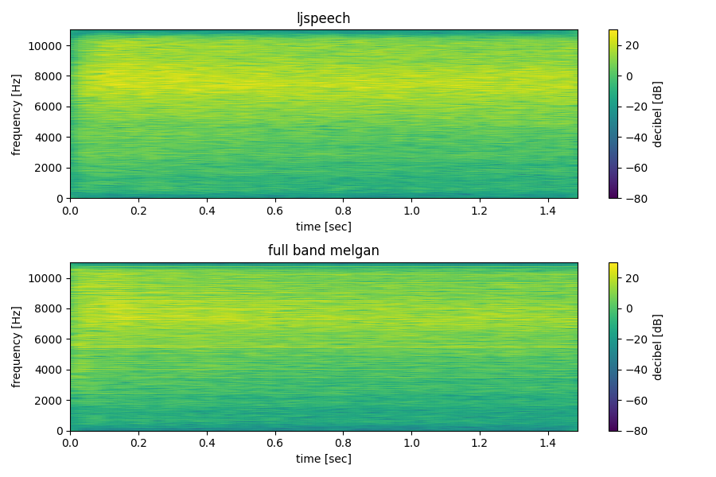

All audio files have been generated using the `discover_fingerprints.py` script.
The name of the directory denotes the name of the wavelet used for the stationary wavelet transform and its inverse.

### How to discover the GAN fingerprints?
Inspired by "Do GANs leave artificial fingerprints?" (https://arxiv.org/abs/1812.11842) from Marra et al.

1. Compute SWT decomposition with given wavelet
2. Compute "denoised" (high-passed) residual = a - b
   1. a = complete reconstruction
   2. b = reconstruction with first level coefficients set to zero (low-passed audio)
3. Compute arithmetic mean over all residuals

### What is audible?
The fingerprint of the reference sets (LJSpeech or JSUT) is similar to white/pink/brown noise. The structure of the 
noise is also represented in the fingerprints of the GAN generators, however there are also noticeable artifacts.
These artifacts are certain frequencies that are sticking out of the random noise.

#### Spectrogram Example

